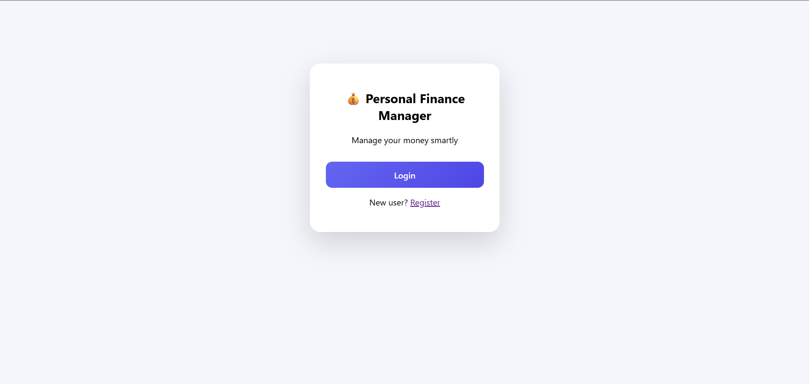
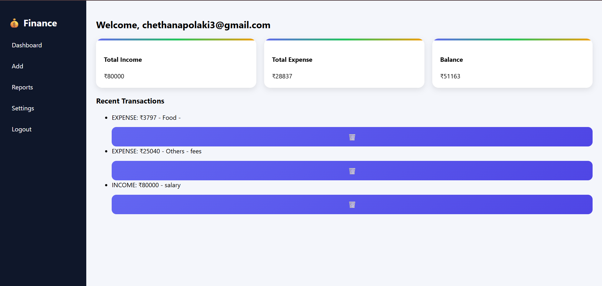
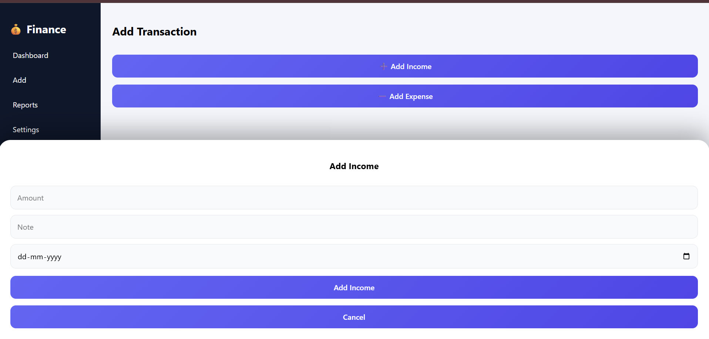
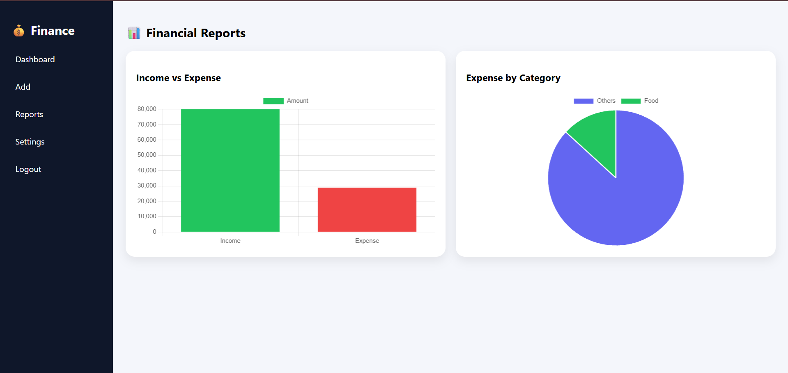

# 💰 Personal Finance Manager

A modern, responsive personal finance management web application to track **income, expenses, balance**, and **visualize spending** with interactive charts.

Built with **HTML, CSS, and JavaScript** using **LocalStorage** for data persistence.

## 📸 Screenshots

### 🔐 Login

### 📊 Dashboard

### ➕ Add Transaction

### 📈 Reports

---

## 🚀 Features

- 🔐 User Authentication (Register / Login)
- ➕ Add Income & Expenses using modern popup UI
- 📊 Animated Dashboard with:
  - Total Income
  - Total Expense
  - Balance
- 📈 Reports Page:
  - Income vs Expense Bar Chart
  - Category-wise Expense Pie Chart
- 🗑️ Delete Transactions
- 💾 Data stored in Browser LocalStorage (no backend required)
- 🎨 Modern UI with:
  - Popup modals
  - Bottom-sheet forms
  - Animated cards
- 📱 Responsive & clean design

---

## 🛠️ Tech Stack

- **Frontend:** HTML, CSS, JavaScript  
- **Charts:** Chart.js  
- **Storage:** Browser LocalStorage  
- **Version Control:** Git & GitHub  

---

## 📂 Project Structure
Personal-Finance-Manager/
│
├── index.html # Login page (popup)
├── register.html # Register page
├── dashboard.html # Main dashboard
├── add.html # Add income / expense
├── reports.html # Charts & reports
├── settings.html # Settings page
│
├── css/
│ └── style.css
│
└── js/
├── auth.js
├── dashboard.js
├── add.js
├── reports.js
└── settings.js
🖥️ How to Run Locally

Clone the repository:

git clone https://github.com/Srichethanapolaki/Personal-Finance-Manager.git

Open the folder:

cd Personal-Finance-Manager

Open index.html in your browser.

💡 Why This Project?

This project demonstrates:

Real-world application UI/UX

JavaScript data handling and logic building

LocalStorage usage for persistence

Charts & data visualization

Clean project structure

Product-style frontend development

💼 Resume Description

Personal Finance Manager — Web Application
Built a modern finance tracking web application with authentication, animated dashboard, category-wise expense analysis, and interactive charts using HTML, CSS, and JavaScript. Implemented LocalStorage-based persistence and a clean, responsive UI with popup-based interactions.

📌 Future Enhancements

🌙 Dark Mode

📄 Export to PDF / Excel

📊 Monthly trend analysis

👤 Profile page

☁️ Backend integration

👨‍💻 Author

Srichethana Polaki

⭐ Support

If you like this project, give it a ⭐ on GitHub!
